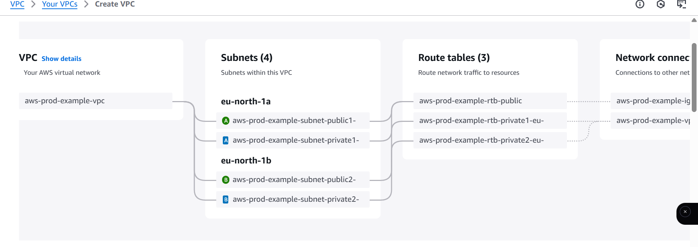
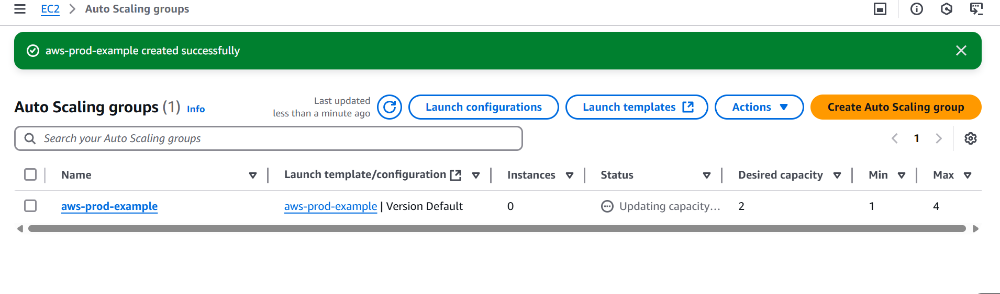
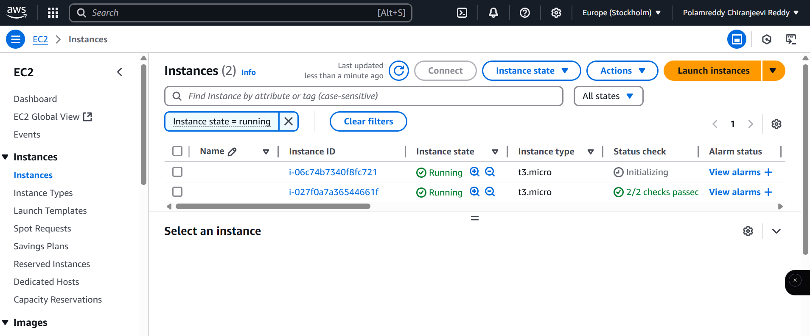
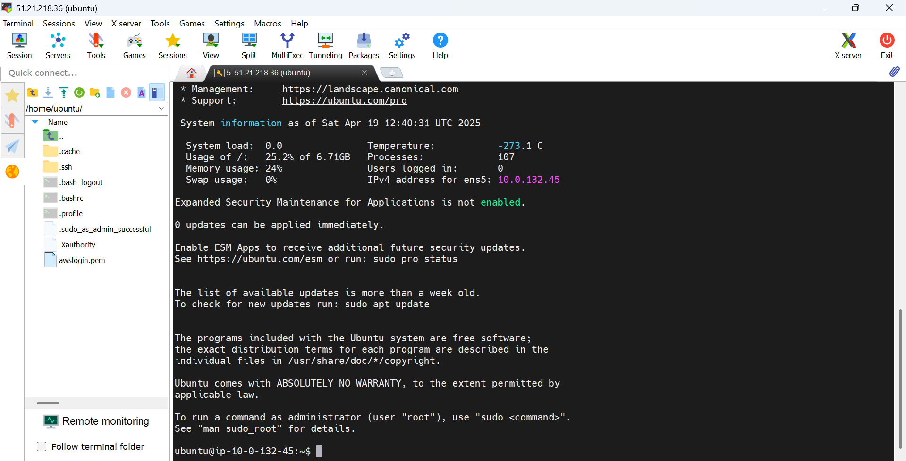
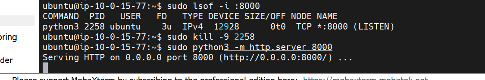
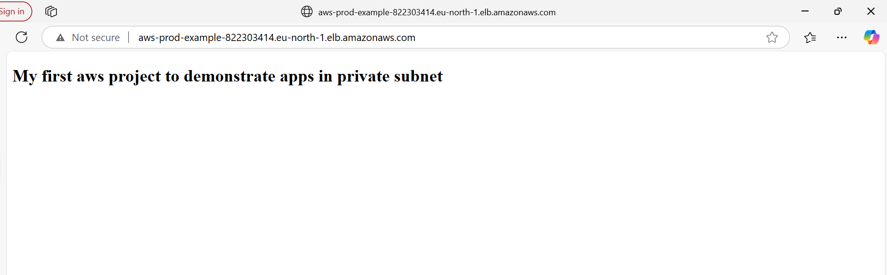

# 🛡️  High Availability Web App Deployment on AWS

This project demonstrates how to securely access an EC2 instance in a private subnet using a Bastion Host (Jump Server) and host a static HTML page via a Python HTTP server.

## 📌 Project Overview

The goal is to:
- Create a secure AWS VPC with public and private subnets.
- Launch a Bastion Host in the public subnet.
- Launch an EC2 instance in the private subnet.
- Use MobaXterm to SSH into the Bastion Host, and then connect to the private EC2 instance.
- Host an HTML file using Python’s HTTP server.
- Route traffic using a Load Balancer and ensure proper Health Check and Target Group configurations.

## 📌 Project Workflow

- Create a **VPC** with public and private subnets across two Availability Zones.
- Launch a **Bastion Host EC2 instance** in the public subnet to SSH into private EC2s.
- Use **Auto Scaling Group** to launch 2 **private EC2 instances** in the private subnets.
- Host a simple `index.html` app on **Python3 HTTP Server** in one of the EC2 instances.
- Create an **Application Load Balancer (ALB)** pointing to the private instances.
- Configure **target groups** and **health checks**.
- Test the **DNS URL** of the Load Balancer.

## 🧰 Technologies Used

- AWS EC2, VPC, Subnets, Security Groups, Auto Scaling Group
- Python3 HTTP Server
- SSH via MobaXterm
- Application Load Balancer
- Target Groups & Health Checks

## 🪜 Steps to Succeed

1. **VPC & Subnets**:
   - Create a custom VPC with a public and private subnet.
   - Enable Auto-assign public IP for the public subnet.

   
   

2. **Security Groups**:
   - Bastion Host SG: Allow inbound SSH from your IP.
   - Private EC2 SG: Allow inbound only from Bastion Host SG and ALB.
     

3. **Launch EC2 Instances**:
   - Bastion Host in Public Subnet.
   - Private EC2 (Amazon Linux/Ubuntu) in Private Subnet.

4. **SSH Configuration**:
   - Use `awslogin.pem` with MobaXterm to SSH into Bastion.
   - Then SSH into the private instance using internal IP.
   

5. **HTML Hosting**:
   - Create an `index.html` using `vim`.
   - Run `sudo python3 -m http.server 8000`
    

6. **Load Balancer Setup**:
   - Create ALB, configure listener on port 80.
   - Register private EC2 with Target Group.
   - Adjust Health Check path to `/`.

7. **DNS Access**:
   - Use DNS link from ALB to access hosted page.
   

## 🛠️ Files Included

- `architecture.txt` – Describes the overall architecture used.
- `commands.txt` – All required AWS & Linux commands.
- `steps-to-succeed.txt` – Chronological steps for project success.
- `notes.txt` – Concepts, observations, issues, or future improvements.

---

## ✅ Checklist

- [x] VPC with public/private subnets
- [x] Bastion Host access via MobaXterm
- [x] Private EC2 connected via Bastion
- [x] Static HTML served from private EC2
- [x] ALB routing verified via DNS

---

> ⚠️ Make sure your target group health check path and port match your server’s configuration.
